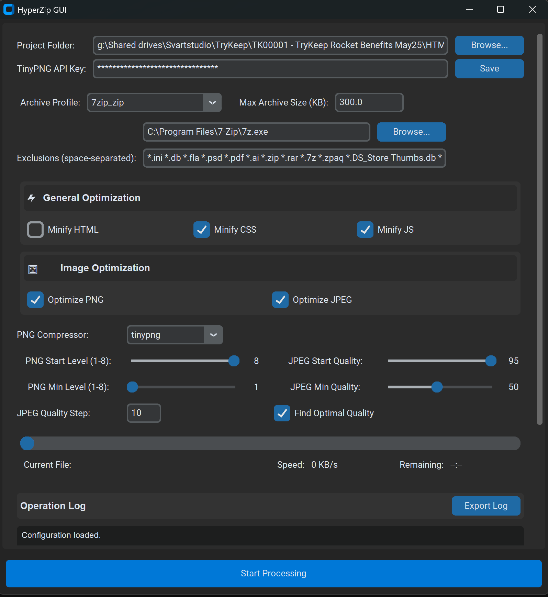

# HyperZip - Banner Archive Optimization Tool

HyperZip is a desktop application for optimizing and compressing banner folders to meet size requirements. It uses minification for HTML/CSS/JS and image compression via TinyPNG to reduce file sizes, then archives the optimized files using your preferred archiver.

## Features

- **Multiple Archive Formats**: Support for ZIP, RAR, 7Z, and ZPAQ formats
- **HTML/CSS/JS Minification**: Reduces text file sizes by removing unnecessary characters
- **Image Compression**: Optimizes PNG and JPEG images using TinyPNG API
- **Quality Adjustment**: Automatically adjusts image quality to meet target size
- **Optimal Quality Search**: Finds the highest possible quality that still meets size requirements
- **User-Friendly Interface**: Easy-to-use GUI with real-time progress logging
- **Configuration Saving**: Remembers your settings between sessions

## Installation

### Windows

1. Download the HyperZip executable
2. Run the executable
3. Ensure WinRAR, 7-Zip, and ZPAQ folders are active at all times (no inactive profiles)

## Usage

1. **Select Project Folder**: Choose the directory containing banner folders to process
2. **Configure Archive Settings**: Select your preferred archiver and set paths
3. **Adjust Optimization Settings**:
   - Enable/disable minification
   - Enable/disable image compression
   - Configure PNG optimization settings:
     - PNG Start Level (1-8): Default 8
     - PNG Min Level (1-8): Default 1
   - Configure JPEG quality settings:
     - JPEG Start Quality (10-95): Default 90
     - JPEG Min Quality (10-95): Default 30
     - Find Optimal Quality option for best results
4. **Set Target Size**: Specify the maximum size in KB for the output archives
5. **Start Processing**: Click the "Start Processing" button
6. **Monitor Progress**: Watch the log area for real-time updates

## Troubleshooting & Recommendations

### For Best Performance

1. **Run as Administrator**: Running HyperZip with administrator privileges helps prevent file access issues, especially when working with system-protected directories.

2. **Disable Antivirus Temporarily**: Some antivirus software may interfere with file operations, particularly when creating and deleting temporary folders. Consider temporarily disabling your antivirus during processing.

3. **Correct Archiver Paths**: Ensure you've set the correct paths to your archiver executables:
   - WinRAR: Usually `C:\Program Files\WinRAR\WinRAR.exe`
   - 7-Zip: Usually `C:\Program Files\7-Zip\7z.exe`
   - ZPAQ: Path to where you've installed the ZPAQ executable

4. **Temporary Folder Issues**: If you encounter problems with temporary folders not being deleted:
   - Restart the application
   - Ensure no other programs are accessing files in the project directory
   - Run as administrator
   - Manually delete any folders ending with `_temp` if they persist

5. **TinyPNG API Key**: For image compression to work, you need a valid TinyPNG API key. Get one for free at [TinyPNG Developer API](https://tinypng.com/developers).

6. **Processing Large Projects**: When processing large projects:
   - Close other memory-intensive applications
   - Ensure you have sufficient disk space for temporary files
   - Be patient during processing, as image optimization can take time

7. **Windows 11 Specific**: On Windows 11, if you encounter issues with temporary folders not being deleted:
   - Run as administrator
   - Disable any file monitoring software temporarily
   - Ensure Windows Defender is not blocking the application

## License

[MIT License](LICENSE)

## Acknowledgments

- [CustomTkinter](https://github.com/TomSchimansky/CustomTkinter) for the modern UI
- [TinyPNG](https://tinypng.com/) for the image compression API

## Copyright

© 2025 [svarts] (https://svartstudio.com/). All rights reserved.
